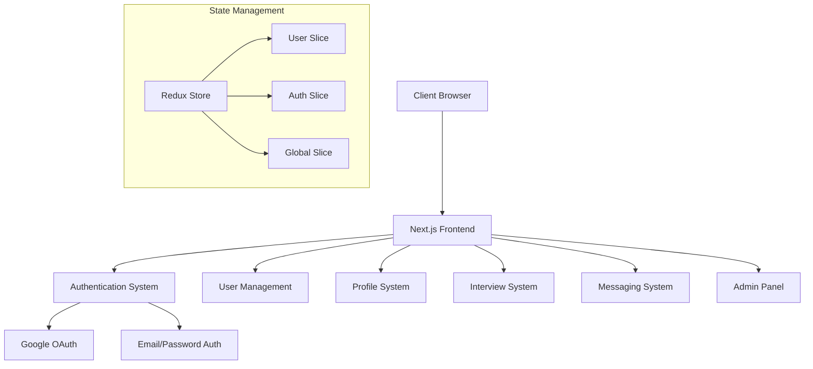
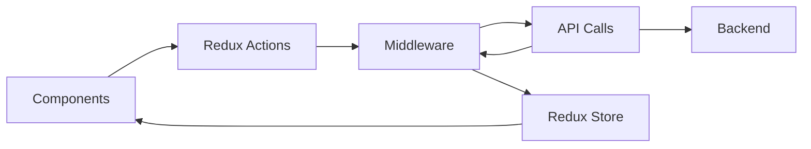
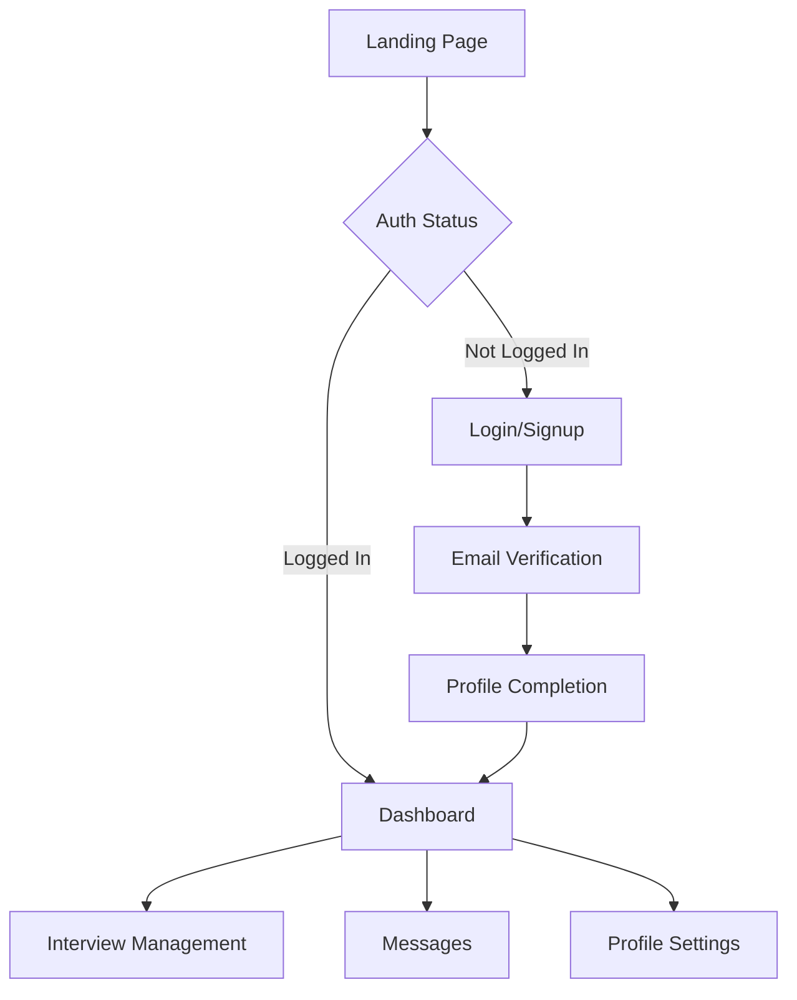

# Candidace Frontend Codebase Analysis

## Overview

This document provides a multi-perspective analysis of the Candidace frontend codebase, examining it from architectural, development, and product management viewpoints.

## Architecture Perspective

### System Architecture

### Key Components

1. **Authentication System**

   - Supports multiple auth methods (Email/Password, Google OAuth)
   - JWT-based authentication
   - Email verification flow
   - Password reset functionality

2. **User Management**

   - Profile management
   - Role-based access control (Admin, Author, Regular users)
   - User preferences and settings

3. **State Management**
   - Redux implementation with slice pattern
   - Persistent storage configuration
   - Middleware for async operations

## Developer Perspective

### Code Organization

1. **Project Structure**
   - `/src/components`: Reusable UI components
   - `/src/store`: Redux state management
   - `/src/services`: API and external service integrations
   - `/src/utils`: Helper functions and utilities
   - `/src/pages`: Next.js page components
   - `/src/hooks`: Custom React hooks

### Technical Stack

- **Frontend Framework**: Next.js
- **State Management**: Redux with Redux Toolkit
- **Styling**: Tailwind CSS
- **Authentication**: Custom implementation with Google OAuth support
- **Form Handling**: Custom implementations with validation
- **API Integration**: Axios-based service layer

### Code Quality and Patterns

1. **Component Architecture**

   - Modular component design
   - HOC patterns (e.g., withAuth)
   - Reusable UI components

2. **State Management**

   - Clear separation of concerns in Redux slices
   - Middleware for async operations
   - Persistent storage configuration

3. **Security Features**
   - Protected routes
   - Authentication middleware
   - Input validation
   - Token management

## Product Management Perspective

### Feature Sets

1. **Core Features**

   - User authentication and authorization
   - Profile management
   - Interview scheduling and management
   - Messaging system
   - Admin dashboard

2. **User Experience**
   - Responsive design
   - Progressive form completion
   - Real-time notifications
   - Error handling and user feedback

### User Flows

### Growth Potential

1. **Scalability Considerations**

   - Modular architecture for easy feature addition
   - Component reusability
   - Clear separation of concerns

2. **Integration Capabilities**
   - Well-structured API layer
   - Extensible authentication system
   - Configurable state management

## Areas for Improvement

1. **Technical Debt**

   - Consider implementing TypeScript for better type safety
   - Enhance test coverage
   - Standardize error handling patterns

2. **Architecture Enhancements**

   - Implement WebSocket for real-time features
   - Consider micro-frontend architecture for scaling
   - Enhance caching strategies

3. **Developer Experience**
   - Add comprehensive documentation
   - Implement automated testing pipelines
   - Standardize component development patterns

## Conclusion

The codebase demonstrates a well-structured Next.js application with clear separation of concerns and modern development practices. The architecture supports scalability and maintainability while providing a solid foundation for future enhancements.
